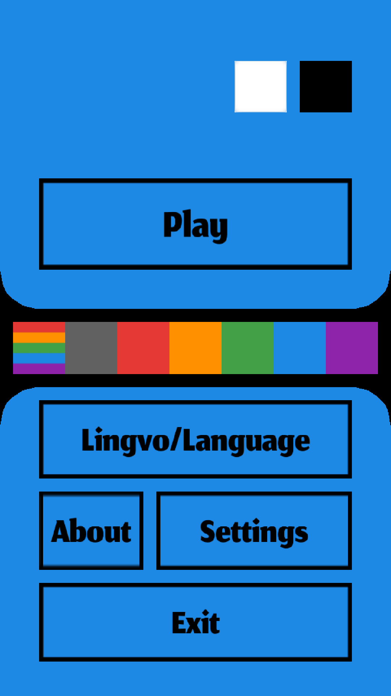

# Turo3

Build a tower as tall as possible

*This game is ported from Godot Game Engine v2.1.x to v3.0.x and its source code is
translated to English.*

*old repository:  https://github.com/HassanHeydariNasab/turo*

<noscript></noscript>

| |  |  |
|:-:|:-:|:-:|
| |  |  |
